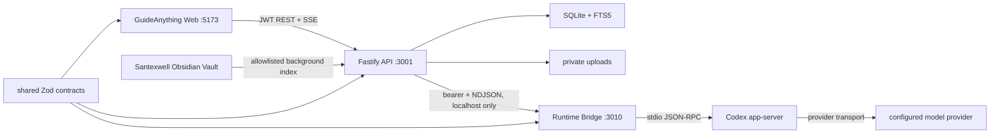
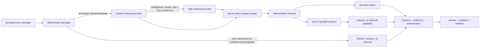

# GuideAnything 架构说明

## 1. 当前产品边界

GuideAnything 是以工作区为权限边界的流程教学与只读知识问答工作台。当前真实资源领域包括指南、工作区资料、流程语义快照、Santexwell canonical Vault、私有会话/附件、Agent 运行事件、引用和产物。Ontology 已从本阶段导航、路由和运行时中移除，避免与流程语义和 Agent 输出形成重复产品面。

仓库采用 TypeScript pnpm monorepo：

- `apps/web`：React、Vite、React Router、React Flow；负责工作台 Shell、Santexwell 门户、资料、Agent、产物、指南编辑和学习模式。
- `apps/api`：Fastify、SQLite/FTS5；负责身份/授权、知识索引、确定性检索、路由编排、SSE、引用重授权与业务持久化。
- `apps/runtime-bridge`：只监听 localhost 的 Codex app-server 包装层；负责模型角色、严格隔离、NDJSON 事件和 cancel/steer 控制。
- `packages/contracts`：前后端/Bridge 共用的 Zod 协议，包括来源、路线、事件、证据、引用、产物和 FlowKnowledgeSnapshot。
- `packages/canvas-core`：画布历史/布局/子指南算法，以及从 CanvasDocument 编译流程语义投影的纯函数。

## 2. 运行拓扑

浏览器只访问 API，不接触 Vault 绝对路径、SQLite、Bridge token、Codex auth 或内部 locator。API 先完成检索和授权，再把有界证据作为不可信 JSON 放入 Prompt Harness。Bridge 没有 Vault 或工作区文件根目录，`allowedRoots` 必须为空。Bridge 禁止的是模型可调用工具、沙箱网络和 Web 搜索；Codex app-server 到已配置模型 provider 的传输仍需网络，不能把真实 Runtime 描述为完全离线。

## 3. 知识来源与索引

统一知识索引由 `knowledge_sources → knowledge_documents → knowledge_fragments → knowledge_fragment_search` 构成，来源分为：

1. `WORKSPACE_FLOW`：从当前草稿 revision 和不可变发布版本编译 `FlowKnowledgeSnapshotV1`。
2. `WORKSPACE_DOCUMENT`：工作区内持久资料，支持 `.md/.txt/.pdf/.docx`。
3. `SESSION_ATTACHMENT`：当前用户、工作区、会话和本轮消息显式选择的短期附件。
4. `SANTEXWELL`：Vault `wiki_v2` canonical allowlist；不遍历任意个人笔记或原始目录。

Vault 在 API 开始监听后执行首次后台扫描，之后每 5 分钟刷新。扫描先读取固定 Harness allowlist，再枚举 canonical 页面，全部解析成功后才原子发布新 generation；失败时旧 generation 继续可读。文件读取使用真实根目录 containment、拒绝 symlink、稳定 stat/open 检查和大小/结构上限。

工作区上传和会话附件在事务中创建 source/document/fragments；解析失败会留下安全的失败状态而不是半成品 `READY` 记录。附件默认 7 天到期，不登记为工作区永久资源。

### 3.1 编辑知识演进域

`CanvasDocument` 与不可变 `GuideVersion` 仍是唯一的流程事实源；`FlowKnowledgeSnapshotV1` 只是从它们编译出的不可编辑语义索引。编辑知识演进是完全隔离的工作区域，使用 `workspace_question_clusters`、`workspace_knowledge_cards`、`workspace_flow_proposals`、操作、证据与审计表，**从不**写入 `knowledge_sources / knowledge_documents / knowledge_fragments`，因此不会被普通 Agent 检索。

- 仅 `OWNER` 与工作区 `EDIT` 成员能读取或改变聚类、知识卡和流程提案；`VIEW` 直接访问也返回 `403`。原始用户问题仅 `OWNER` 能按需读取，编辑者只见脱敏聚类摘要与计数。
- Agent 提交的工作区答案只有在内部来源已启用且 `evidenceStatus` 为 `PARTIAL / INSUFFICIENT / CONFLICTING` 时才产生聚类信号。聚类 key 来自工作区、已授权流程锚点与规范化问题的哈希；不保存模型推理，也不把问题文本放入编辑者列表。
- 知识卡和流程提案都是编辑草稿。提案使用严格的 `ADD/UPDATE/REMOVE` Canvas operation 协议、目标 `guideId` 与 `baseRevision`；`canvas-core` 在变更前验证节点、连线、步骤和入口出口的拓扑完整性。
- 编辑者明确接受并应用提案时，草稿 revision、提案状态和审计事件在同一事务更新。revision 不匹配时提案被标记为 `STALE`，不修改流程。应用成功后才生成新的 draft Flow snapshot；发布仍走原有作者专属生命周期。Agent 永远不自动写回流程。

## 4. 流程图如何变成 Agent 证据

`compileFlowKnowledgeSnapshotV1` 把编辑器画布编译成不可变语义快照：

- 业务节点：标题、明细、阶段、责任泳道、入/出边、分支、一步/两步邻域。
- Markdown、图片、视频：正文、caption、图片标注、视频关键点和可跳转 `nodeId`。
- origin：草稿 `revision` 或发布 `versionId/version`。
- locator：仅含 `guideId/snapshotId/nodeId`，不含本机路径。

内部 Agent 搜索保留同一指南内多个相关 fragment；公开搜索页仍按文档去重。答案提交前会从当前数据库重建 authoritative locator。打开引用时再次检查工作区成员资格、指南 owner/collaborator、草稿 revision 或发布版本，并确认业务节点或资源节点仍存在；有效引用返回：

- 草稿：`/guides/:guideId/edit?nodeId=:nodeId`
- 发布版：`/versions/:versionId/learn?nodeId=:nodeId`

因此流程反馈可以准确落到判断节点、Markdown 说明、图片或视频，而不是只返回整张图。

## 5. Router、检索与 Map-Reduce

每条消息先持久化来源开关、selected context、附件 ID 和 `planVersion`，再进入编排：

- Fast Gate 只接受严格白名单内、长度受限且没有 selected context/会话附件的问候、致谢和使用帮助；它不会用关键词猜测领域答案。任何领域自然语言，即使很短，都进入 medium reasoning Router。
- `DIRECT/FOCUSED` 使用小预算，最多一个 worker；不会因为用户随手一问就扫描全部来源。
- `COMPOSITE/OPEN_RESEARCH` 只在复杂度和明确意图支持时启用，最多三个并行 worker。
- Deep Router 只能收紧 medium 路线，不能新增来源、任务或预算。
- 工作区来源按流程、资料、附件优先；若当前路线的工作区证据已充分，可跳过 Vault worker。
- Reducer 只接收 task findings，不能再次检索或新增 evidence/locator。
- Router 和 Reducer 不注入完整 Santexwell skill bundle；只有实际读取 Santexwell 的 worker 使用索引器已验证的 last-good Prompt Harness。
- 流程、工作区资料或会话附件 worker 使用版本化 `guideanything-workspace-query` bundle：选中上下文优先、按服务端预算限跳、仅引用已授权 evidence/locator，并禁止把工作区流程事实与外部资料混同。bundle 的内容哈希版本记录在公开计划的结构化 metadata 中，但不公开其完整提示内容。

模型输出不直接成为引用。worker 只能回传服务端提供的 evidence ID；API canonicalize 后再次解析 locator、权限、revision/checksum，最后才写入答案。

## 6. 流式协议与恢复

API 将每个公开事件先写入 `agent_run_events`，再通过 SSE 推送。事件分为：

- `PROVISIONAL`：路线、计划、任务进度/finding、答案草稿；steer 后旧 `planVersion` 标记 `stale`。
- `COMMITTED`：验证、引用、最终答案、产物、完成/失败/取消；永不标 stale。

Runtime Bridge 只会把 final `ANSWER` turn 的 `agentMessage/delta` 标记为私有 `STRUCTURED_OUTPUT_DELTA`；route/task 的输出以及 commentary/reasoning 不进入该通道。API 的增量 decoder 只解析结构化 JSON 顶层 `conclusion` 字符串并生成公开 `answer.draft.delta`，不会转发 raw JSON、其他字段或 evidence locator。最终 `conclusion` 必须与流式前缀一致，并在完整 schema、evidence、权限和 revision 校验后才作为 committed answer 写入。

客户端用 `Last-Event-ID` 续传，服务端按 sequence 回放并发送 heartbeat。断线不会丢失运行状态。cancel 会中止所有活动 child run；steer 先事务写入新的 `planVersion` 和指令，再取消旧 child 并重新路由。进程收到退出信号时会停止接受新 Agent 运行，abort 并等待 Vault refresh，取消/等待活动 child，再关闭数据库。Bridge 关闭时 HTTP app 进入 closing 并与 Codex runtime 并发收口，避免串行关闭窗口继续接收新运行。

API 启动会按时间顺序恢复持久化的 `QUEUED` 运行；上个进程遗留在 `ROUTING/RUNNING/VALIDATING` 的 orphan run 会原子追加可重试的 `RUNTIME_RESTARTED` terminal failure，使 SSE 正常结束而不是永久悬挂。单个 map worker 的可降级失败会形成 `PARTIAL` finding 和明确 gap；上下文/权限、schema、证据冲突、引用版本变化等错误 fail closed。

## 7. Runtime Bridge 隔离

真实运行使用专属 `CODEX_RUNTIME_HOME` 和空 `CODEX_RUNTIME_WORK_DIR`：

- home 必须为空、已安全预置，或带 `.guideanything-runtime-home` 所有权标记；不会接管个人 `~/.codex`。
- `config.toml` 必须精确等于 Bridge 最小配置；重启清理生成型 system skills 前会重新验证 marker、config 和 auth。
- auth 只能是显式普通文件的 symlink，或隔离 home 中预置的普通 `auth.json`；Bridge 不读取/复制凭据。
- 每次模型调用使用 `ephemeral: true` 的 thread，不把运行会话沉淀到隔离 home；数据库中的 `runtime_thread_id` 仅为兼容保留字段，不作为恢复来源。
- `approval_policy=never`、`sandbox_mode=read-only`、`web_search=disabled`，并显式禁用 shell、工具/沙箱 network、MCP、plugins、browser/computer use、image generation、memories、personal skills 和 multi-agent。provider transport 不在这个工具网络能力内。
- 子进程环境只保留最小 allowlist，Bridge 仅绑定 `127.0.0.1`；API/Bridge token 不可通过健康接口枚举。
- 五个模型角色必须显式映射到 Codex 暴露的模型。缺失角色、未知模型、异常 capability、token 超限或协议违规会使健康状态 `DEGRADED` 并拒绝新运行。
- Bridge 模式要求独立、至少 32 字符且不是仓库公开 sentinel 的 bearer token；生产 API 同样拒绝缺失、短值或已知示例值的 `JWT_SECRET`。

开发环境可用 `AGENT_RUNTIME_MODE=fake` 启动确定性只读 runtime。它不读取外部数据，只能基于 Prompt 中服务端已经验证的 evidence 生成路线/finding/答案；生产环境明确拒绝 fake mode。

## 8. 权限、隐私与产物

- 全局与工作区会话都属于当前 owner；即使两人同在一个工作区，也不能互读会话、附件、答案或产物。
- 工作区 Agent 对所有网页角色均只读；`VIEW/LEARNER` 可以问答，但不能借 Agent 获得原本无权读取的草稿。
- 引用使用不透明 `referenceId`。前端只得到公开 title/excerpt 与重新授权后的 target；绝对路径、storage key、内部 checksum 和 Bridge thread 不公开。
- 知识候选的 scope、owner、工作区成员和流程可见性约束在 SQL `LIMIT` 前应用；结果映射仍执行第二层授权。引用若因权限变化成为 `FORBIDDEN`，解析响应用通用 title/excerpt 代替历史保存的受保护文案。
- 产物支持 `REPORT/DIAGRAM/FLOW_PROPOSAL/REFERENCE_COLLECTION`。`FLOW_PROPOSAL` 只是只读建议，不自动修改 CanvasDocument。
- 所有 Prompt 中的用户消息、检索内容、附件、Markdown/frontmatter/wikilink 都按不可信数据处理；不展示模型隐藏推理，只展示用户可验证的计划、进度、findings 和答案。

## 9. 页面边界

- `/knowledge/santexwell`：全局 Vault 门户、搜索、文档和私有问答。
- `/workspaces/:workspaceId/sources`：持久工作区资料与流程快照。
- `/workspaces/:workspaceId/agents`：来源开关、会话附件、流式问答和 steer/cancel。
- `/workspaces/:workspaceId/artifacts`：当前用户的持久产物。
- `/workspaces/:workspaceId/knowledge-evolution`：`OWNER / EDIT` 专属的脱敏问题聚类、知识卡、流程提案审阅和显式草稿应用；不是普通知识检索入口。
- `/references/:referenceId`：API 重新授权后跳转到真实目标。

当前没有 Ontology 页面、导航项、构建任务或运行时 provider。
