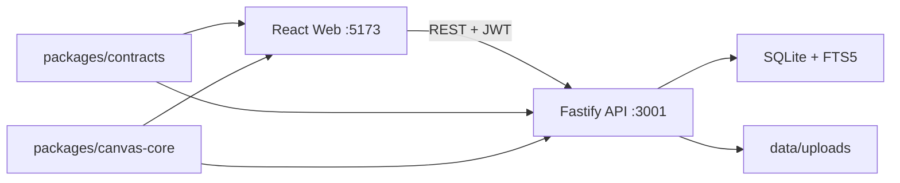

# GuideAnything 架构说明

## 1. 方案选择

采用 TypeScript pnpm monorepo：

- `apps/web`：React + Vite + `@xyflow/react`，负责编辑器、搜索和学习模式。
- `apps/api`：Fastify REST API，负责认证、授权、指南生命周期、搜索、引用快照和媒体上传。
- `packages/contracts`：Zod schema、API DTO 和多模态节点协议，前后端共用。
- `packages/canvas-core`：纯函数形式的画布历史、复制粘贴、子指南展开/折叠算法，便于单元测试。
- `data`：SQLite 数据库与本地上传文件，默认不提交版本库。

选择该方案的原因：React Flow 已提供受控节点/边、平移缩放、MiniMap、Background、快捷键和可访问性基础；Fastify 适合 schema 驱动的独立 API；Node 24 内置 SQLite 驱动避免本地原生模块安装风险。Next.js 单体不符合明确的前后端边界，自研 Canvas/WebGL 则会把首条可演示链路的风险集中在低层交互。

## 2. 运行拓扑

Web 只通过 `/api` 与后端交互，开发期由 Vite proxy 转发。媒体由 API 生成不可猜测的 ID 并经受控静态路由读取。

## 3. 前端边界

- `features/auth`：登录、会话恢复、角色提示。
- `features/library`：已发布指南搜索、预览、进入编辑/学习、插入子指南。
- `features/editor`：React Flow 受控状态、工具栏、属性面板、自动保存、快捷键、历史栈。
- `features/nodes`：每种节点一个记忆化组件；媒体只在可见/展开时加载。
- `features/lesson`：步骤导航、节点聚焦和视频关键点跳转。
- `lib/api`：统一携带 token、解析错误和处理 `401/409`。

编辑器使用服务器工作副本作为持久化真相，前端历史栈作为交互真相。保存成功后更新 `revision`；冲突时保留本地状态并提示重新载入，不静默覆盖。

## 4. 后端边界

- `modules/auth`：密码验证、JWT 签发与请求身份。
- `modules/guides`：工作副本 CRUD、协作者授权、发布事务、版本读取。
- `modules/search`：发布快照的 FTS 索引与查询。
- `modules/media`：multipart 流式上传、白名单和大小校验。
- `modules/references`：验证被引用版本可见性，调用纯算法生成展开预览。

路由只做解析和响应；repository 隔离 SQL；service 组合权限与事务；纯算法不依赖 Fastify/SQLite。

## 5. 画布与引用算法

保存结构为 `CanvasDocument { nodes, edges, viewport, steps, entryNodeId, exitNodeIds }`。展开输入为当前画布、引用节点、固定版本快照：

1. 若已存在同 `referenceNodeId` 的展开产物，恢复其可见性并校正缺失的桥接边/来源信息，保证幂等和旧草稿兼容。
2. 计算源图包围盒，将源入口节点平移到引用节点右侧 320px，并将所有坐标按同一向量转换。
3. 为所有源节点和边创建确定性命名空间 ID；重写边端点、步骤关联和视频关键点目标。
4. 新增引用节点到源入口的代理边。展开时记录并隐藏原有“引用 → 宿主下游”续接边，为每个源出口复制对应的“出口 → 原下游”桥接边；这样不会回流至入口或绕过子指南。
5. 产物携带来源元数据，首次展开会把快照入口/出口 ID、原续接边及其可见状态持久化到引用节点。React Flow 边变更往返时保留这些元数据；折叠时恢复原续接边，并依据整条引用祖先链隐藏所有触及展开产物的边；删除宿主续接边会同步清理失效出口代理，再次展开恢复为 `false`，不重新复制。

该策略让下游固定在已发布快照，避免上游更新破坏布局；显式升级会先删除旧命名空间产物，再基于新版本展开，并记录新的来源版本。

## 6. 性能与安全

- 自定义节点、`nodeTypes`、事件回调和默认边配置保持稳定引用；不在侧栏订阅完整节点数组。
- 首版依赖 React Flow 的可见区域优化，折叠树用 `hidden`，媒体加 `loading=lazy/preload=metadata`；加入 1000 节点算法基准测试。
- Markdown 用 `react-markdown + remark-gfm + rehype-sanitize`；URL 仅允许 `http/https`。
- API 使用 Zod/JSON schema 校验，异步权限检查位于 handler/service，数据库不在 schema validator 中访问。

## 7. 参考的一手资料

- [React Flow Quick Start](https://reactflow.dev/learn)
- [React Flow Save and Restore](https://reactflow.dev/examples/interaction/save-and-restore)
- [React Flow Performance](https://reactflow.dev/learn/advanced-use/performance)
- [Fastify Validation and Serialization](https://fastify.dev/docs/latest/Reference/Validation-and-Serialization/)
- [Drizzle SQLite](https://orm.drizzle.team/docs/sqlite/get-started-sqlite)
- [pnpm Workspaces](https://pnpm.io/workspaces)
