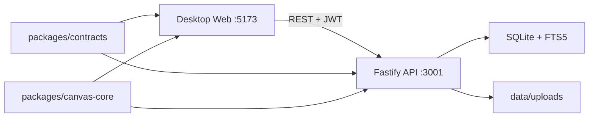
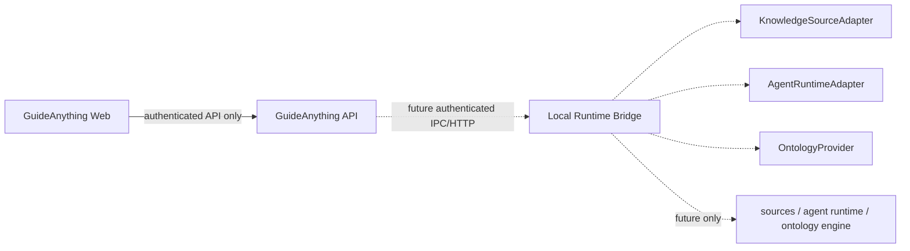

# GuideAnything 架构说明

## 1. 产品与代码边界

GuideAnything V1 是以工作区为权限和知识边界的桌面知识工作台，指南是当前唯一已实现的资源领域。工作区、个人视图和指南的数据均来自 API/SQLite；资料源、Agent、Ontology 和会话与产物只有可导航的诚实空状态与共享契约，没有运行时实现。

仓库采用 TypeScript pnpm monorepo：

- `apps/web`：React + Vite + React Router + React Flow，负责工作台 Shell、工作区、个人视图、指南编辑和学习模式。
- `apps/api`：Fastify REST API，负责身份、服务端授权、指南生命周期、个人状态、搜索、引用快照和媒体。
- `packages/contracts`：前后端共用的 Zod schema、DTO、Canvas 协议与未来适配器接口。
- `packages/canvas-core`：画布历史、复制粘贴、布局和子指南展开/折叠的纯函数。
- `data`：SQLite 数据库和本地上传文件，默认不提交。

## 2. V1 运行拓扑

Web 只通过 `/api` 访问后端，开发期由 Vite proxy 转发。工作区为一级实体；`workspace_items` 只登记通用属性和领域实体 ID，指南完整文档仍由 `guides`/`guide_versions` 管理。

## 3. 页面与模块拓扑

工作台 Shell 中的指南库、收藏夹、最近查看、与我共享、回收站和工作区列表均是真实 URL。工作区概览汇总说明、负责人、权限、指南数量、活动和收藏。`/workspaces/:workspaceId/guides` 复用指南库并限定工作区；`sources`、`agents`、`ontology`、`artifacts` 仅渲染明确的未配置状态，不显示伪造输入框、同步结果或 Agent 回答。

指南编辑器和学习模式在 Shell 外按需加载，通过受限的 `returnTo` 查询参数返回原工作区上下文。只有指南成功载入后才记录最近查看。

## 4. 后端与权限边界

路由负责解析和响应，repository 隔离 SQL，service 组合身份、权限和事务。授权必须在 API 完成：

- `OWNER` 管理工作区和资源；`EDIT` 可创建/编辑；`VIEW` 只查看可见的已发布资源。全局用户角色仍是能力上限。
- 显式指南协作者进入“与我共享”；普通工作区成员不会被误认为显式共享。
- 收藏和最近查看属于当前用户；写入前重新验证资源可见性。
- 未授权的工作区/资源访问返回 404，前端按钮隐藏不是安全边界。
- 回收使用 `workspace_items.deleted_at/deleted_by`；永久移除只允许指南所有者或工作区所有者。

## 5. 画布与固定版本引用

`CanvasDocument` 保存节点、连线、视口、步骤和入口/出口。子指南引用固定到不可变 `guide_versions` 快照；展开使用确定性命名空间、来源追踪和桥接边，折叠恢复原续接边。资源被回收或已发布指南被永久移除时，不删除历史版本，因而不破坏已存引用。

## 6. 未来 Runtime Bridge 拓扑

`packages/contracts/src/adapters.ts` 定义可序列化的配置结果、会话/事件和 Ontology DTO，以及 `KnowledgeSourceAdapter`、`AgentRuntimeAdapter`、`OntologyProvider` 接口。当前仓库没有任何具体 adapter、Runtime Bridge、源同步、Ontology build、Agent 会话或 Codex CLI 调用。

未来实现必须保持：浏览器不直接启动 shell；能力明确声明 `READ/WRITE/EXECUTE` 风险与是否需要批准；工作区范围由服务端强制；写入与命令执行可审计；高风险动作逐次确认；结果保留证据引用。

## 7. 性能与安全

- React Flow 组件类型、回调和默认边配置保持稳定引用；媒体懒加载，折叠树用 `hidden`。
- Markdown 经 `rehype-sanitize` 渲染，URL 限制为 `http/https`；上传执行类型和大小校验。
- 工作副本用 `revision` 乐观锁；发布在单个事务中产生不可变版本并重建当前 FTS 行。
- 当前浏览器验收基线为桌面端 `1440 × 1024`，同时覆盖深色和浅色主题。
