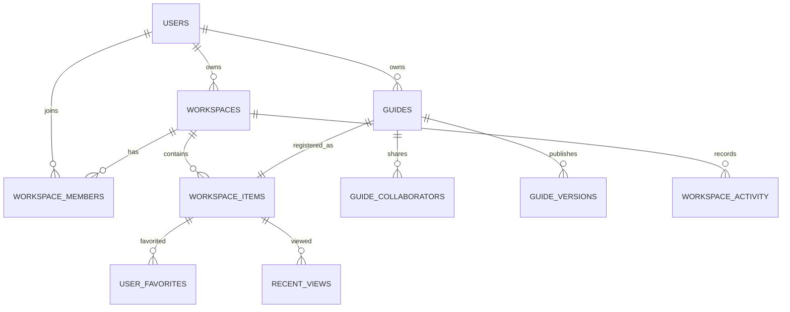

# GuideAnything 数据模型

## 1. 当前 schema（0001 + 0002）

SQLite 使用严格表、外键和 ISO-8601 UTC 文本时间。JSON 写入前必须经共享 schema 校验。

| 表 | 主键与关键字段 | 规则 |
| --- | --- | --- |
| `users` | `id`, `email UNIQUE`, `password_hash`, `display_name`, `role` | 角色为 `AUTHOR/EDITOR/LEARNER`，是能力上限 |
| `guides` | `id`, `owner_id`, `status`, `revision`, `draft_document`, `published_version_id` | 可变工作副本；状态 `DRAFT/PUBLISHED/ARCHIVED` |
| `guide_collaborators` | `(guide_id,user_id)`, `permission` | 显式资源授权，当前只有 `EDIT` |
| `guide_versions` | `id`, `guide_id`, `version`, `document_json`, `published_at` | 不可变发布快照，`UNIQUE(guide_id,version)` |
| `guide_search` | FTS5 `version_id`, `guide_id`, `title`, `summary`, `tags`, `content` | 只索引当前已发布版本 |
| `media_assets` | `id`, `owner_id`, `kind`, `storage_path`, `size` | 图片/视频上传元数据，路径唯一 |
| `workspaces` | `id`, `slug UNIQUE`, `owner_id`, `status` | 知识和权限边界；状态 `ACTIVE/ARCHIVED` |
| `workspace_members` | `(workspace_id,user_id)`, `permission` | 权限 `OWNER/EDIT/VIEW` |
| `workspace_items` | `id`, `workspace_id`, `kind`, `entity_id`, `deleted_at`, `deleted_by` | 通用资源登记；`UNIQUE(kind,entity_id)` |
| `user_favorites` | `(user_id,item_id)`, `created_at` | 用户私有、幂等的收藏状态 |
| `recent_views` | `(user_id,item_id)`, `last_viewed_at`, `view_count`, `context_json` | 同一用户/资源不重复，打开成功后更新计数与时间 |
| `workspace_activity` | `id`, `workspace_id`, `actor_id`, `action`, `item_id`, `metadata_json` | 记录指南创建/更新/发布、添加协作者、回收/恢复 |

`workspace_items.kind` 允许 `GUIDE/SOURCE/AGENT/ONTOLOGY/CONVERSATION/ARTIFACT`，但 V1 只有 `GUIDE` 存在领域表和真实记录；其他 kind 是稳定登记空间，不代表已有功能或示例数据。

## 2. 实体关系



`workspace_items` 保存列表所需的标题、摘要和时间快照；`guides` 保存指南领域真相。更新指南标题/摘要时在同一事务中更新登记快照。

## 3. 权限与个人状态

- 工作区成员权限与全局用户角色共同决定能力；指南协作者是独立的显式编辑授权。
- 资源列表读取连接工作区成员、指南所有者/协作者和当前发布版本，并过滤已删除资源。
- `user_favorites` 和 `recent_views` 的联合主键提供幂等性。资源进入回收站后从默认列表隐藏；恢复后原个人状态可再次显示。
- `workspace_activity.metadata_json` 只保存行为所需的轻量上下文，不记录搜索词或私人阅读内容。

## 4. 指南与版本生命周期

1. 创建指南时必须选择当前用户可创建的工作区，同时创建 `guides` 和 `GUIDE` 登记。
2. 保存工作副本的更新条件包含客户端 `revision`，成功后原子自增。
3. 发布事务校验文档、插入递增且不可变的 `guide_versions`、更新指南状态/当前版本，然后重建该指南 FTS 行。
4. 移到回收站只写入 `workspace_items.deleted_at/deleted_by`，并从活跃工作区、搜索、收藏夹和最近查看的默认查询中隐藏。
5. 恢复清空软删除字段，资源回到原工作区。
6. 从未发布的草稿永久移除时删除 `workspace_items` 和 `guides`。已发布指南永久移除时将 `guides.status` 设为 `ARCHIVED`，删除个人状态和资源登记，但始终保留 `guide_versions`。

## 5. CanvasDocument 协议

```ts
interface CanvasDocument {
  schemaVersion: 1;
  nodes: CanvasNode[];
  edges: CanvasEdge[];
  viewport: { x: number; y: number; zoom: number };
  steps: LessonStep[];
  entryNodeId?: string;
  exitNodeIds: string[];
}
```

流程、Markdown、图片、视频和子指南节点使用共享 schema。子指南节点保存固定 `guideVersionId`、入口/出口快照和续接边状态；`SourceTrace` 记录引用节点、源指南、版本和元素 ID。

## 6. 未来契约（非持久化实现）

`packages/contracts/src/adapters.ts` 只定义 Source/AgentRuntime/Ontology 边界的 schema、DTO 和 TypeScript 接口。当前 schema 没有 source、agent session、agent event、ontology build/entity/relation 领域表；不得把 `workspace_items` 的预留 kind 解读为这些表已存在。未来接入必须通过新迁移增加独立领域表。
