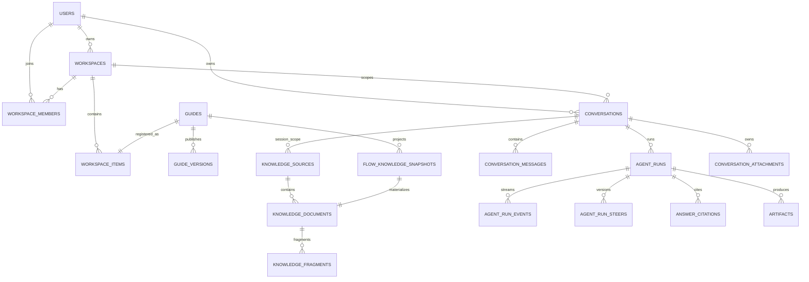

# GuideAnything 数据模型

## 1. 当前迁移

SQLite 使用 STRICT 表、外键、CHECK、触发器和 ISO-8601 UTC 文本时间。JSON 写入前必须通过共享 Zod schema。

- `0001_init`：用户、指南、协作者、不可变发布版本、指南 FTS、媒体。
- `0002_workspace_v1`：工作区、成员、资源登记、收藏、最近查看、活动。
- `0003_santexwell_agent_runtime`：知识索引、流程语义快照、会话、Agent 运行/事件、引用、产物、临时附件。
- `0004_agent_run_steers`：幂等 steer 与 `planVersion` 历史。

## 2. 主要表

| 领域 | 表 | 关键规则 |
| --- | --- | --- |
| 身份 | `users` | `AUTHOR/EDITOR/LEARNER` 是能力上限，资源授权仍由领域表决定 |
| 指南 | `guides` | 可变草稿、乐观锁 `revision`、`DRAFT/PUBLISHED/ARCHIVED` |
| 指南 | `guide_collaborators` | 显式 `EDIT` 草稿授权，不授予发布权 |
| 指南 | `guide_versions` | `(guide_id,version)` 唯一的不可变发布快照 |
| 指南搜索 | `guide_search` | 只索引当前已发布版本 |
| 工作区 | `workspaces`, `workspace_members` | `OWNER/EDIT/VIEW`，状态 `ACTIVE/ARCHIVED` |
| 通用登记 | `workspace_items` | `(kind,entity_id)` 唯一；软删除字段控制回收站 |
| 个人状态 | `user_favorites`, `recent_views` | 用户私有且幂等 |
| 知识来源 | `knowledge_sources` | `GLOBAL/WORKSPACE/SESSION` 与 source kind 的组合由 CHECK 固定；身份字段不可变 |
| 知识文档 | `knowledge_documents` | source 下的 revision/checksum/安全相对 locator；流程文档必须绑定 snapshot |
| 知识片段 | `knowledge_fragments` | 有序 fragment、正文、内部 locator；不对浏览器直接公开 |
| 知识搜索 | `knowledge_fragment_search` | FTS5；触发器与 fragment 增删改同步 |
| 流程语义 | `flow_knowledge_snapshots` | 草稿 revision 或发布 version origin；snapshot 行不可更新 |
| 会话 | `conversations` | `GLOBAL_SANTEXWELL` 必须无 workspace；`WORKSPACE` 必须有 workspace；owner 私有 |
| 消息 | `conversation_messages` | 用户消息保存来源/selected context/附件；助手消息必须是已提交结构化答案 |
| 运行 | `agent_runs` | 单会话递增 sequence；路线、状态、错误和当前 `plan_version` |
| 事件 | `agent_run_events` | `(run_id,sequence)` 唯一；PROVISIONAL/COMMITTED 类型和 stale 由 CHECK 约束 |
| steer | `agent_run_steers` | `(run_id,client_steer_id)` 和 `(run_id,plan_version)` 均唯一 |
| 引用 | `answer_citations` | 不透明 `reference_id`；locator/revision 持久化且引用不可更新 |
| 产物 | `artifacts` | owner + conversation + run 三重归属；四种结构化 kind |
| 会话附件 | `conversation_attachments` | owner/conversation 不可变；安全 storage key、状态、expiry；source 必须同会话 |

`workspace_items.kind` 仍保留早期通用 enum（包括 `ONTOLOGY`），但当前没有 Ontology 领域表、记录生产者、页面或运行时。这个预留值不代表产品能力。

## 3. 关系拓扑



## 4. Source、document 与 fragment

`knowledge_sources` 的 canonical kind 映射：

| API/Agent source | 数据库 kind | scope | 所有权 |
| --- | --- | --- | --- |
| `SANTEXWELL` | `SANTEXWELL_VAULT` | `GLOBAL` | 配置的 canonical Vault generation |
| `WORKSPACE_DOCUMENT` | `WORKSPACE_DOCUMENT` | `WORKSPACE` | workspace + creator；同时登记 `workspace_items.SOURCE` |
| `WORKSPACE_FLOW` | `WORKSPACE_FLOW` | `WORKSPACE` | guide 的不可变语义 snapshot |
| `SESSION_ATTACHMENT` | `SESSION_ATTACHMENT` | `SESSION` | conversation + owner；不登记为持久工作区资源 |

source 状态为 `PENDING/INDEXING/READY/STALE/FAILED/UNAVAILABLE`。索引 generation 只在全部文档和 Harness 校验、数据库发布均成功后切到 `READY`，此后内存中的 Harness 才提升为 last-good；失败不会让新 Harness 配上旧 generation。`STALE` 的上一代文档仍可读，但引用打开时必须精确匹配当时 revision。

`knowledge_documents.relative_locator` 和 `conversation_attachments.storage_key` 只能是受限相对值。真实 Vault 根路径、上传根路径和磁盘文件名不进入公开 DTO。

FTS 候选查询在 SQL `LIMIT` 前应用 source kind、workspace/conversation scope、owner、工作区成员、流程 owner/collaborator 和附件状态/expiry 条件，再做结果层二次授权；不能先截断全局命中后再依赖应用层过滤。

## 5. FlowKnowledgeSnapshot

流程 snapshot 保存：

- guide/workspace/origin/checksum；
- 业务节点语义、阶段、责任、边、分支和两跳邻域；
- Markdown、图片标注、视频关键点等资源；
- 每个业务或资源节点的 `{guideId,snapshotId,nodeId}` locator。

草稿唯一键为 `(guide_id,revision)`；发布版唯一键为 `(guide_id,version_id,version)`。snapshot 不更新；指南变化会产生新 snapshot。知识文档与 snapshot 一对一，数据库触发器防止跨工作区或错误 source 绑定。

## 6. 会话、运行和事件状态

用户消息与 Agent run 在一个事务中创建。`client_message_id` 保证同一会话发送幂等；`run_sequence` 提供稳定顺序。

```text
QUEUED → ROUTING → RUNNING → VALIDATING → COMPLETED
                           ↘ FAILED
QUEUED/ROUTING/RUNNING/VALIDATING → CANCELLED
```

steer 不创建第二条用户消息，而是写入 `agent_run_steers`、递增 `agent_runs.plan_version`，并把旧版本 PROVISIONAL 事件标记 stale。COMMITTED 事件永不 stale。

`answer.draft.delta` 是公开 PROVISIONAL 事件，但内容只能来自 final `ANSWER` 结构化 JSON 顶层 `conclusion` 的安全增量 decoder；raw JSON、其他字段、commentary、reasoning 和内部 locator 不落入公开事件表。助手消息只在最终 validation/authorization 成功后写入，`content` 中包含 `runId + answer`。`answer_citations` 与 `artifacts` 在同一事务中提交，避免界面看到没有引用或半个产物的答案。

API 重启会继续调度 `QUEUED` run；遗留在 `ROUTING/RUNNING/VALIDATING` 的 orphan run 会追加 committed、可重试的 `RUNTIME_RESTARTED` failure 并进入 `FAILED`，保证终态和 SSE 可恢复。`agent_runs.runtime_thread_id` 是 schema 兼容预留字段；真实 Runtime 每次启动 ephemeral Codex thread，不从该字段恢复模型会话。

## 7. 引用与重新授权

引用持久化 canonical internal locator 与 revision，但前端只获得：

```ts
interface PublicReference {
  referenceId: string;
  href: `/references/${string}` | null;
  invalidReason?: string;
}
```

打开 `/api/references/:referenceId` 时，服务端再次验证 owner、workspace membership、conversation、source status、document/fragment、attachment expiry、草稿 revision/协作者或发布版本。有效 target 才包含真实产品路由；失效时返回 `STALE/FORBIDDEN/SOURCE_UNAVAILABLE/NOT_NAVIGABLE` 等安全原因。`FORBIDDEN` 响应使用通用 title/excerpt，不复用 `answer_citations` 中历史保存的受保护文案。

## 8. 会话附件生命周期

- 允许 `.md/.txt/.pdf/.docx`，最大 20 MiB；内容提取仍受类型专属上限。
- 磁盘目录按 owner/conversation 的不可逆 hash 隔离，文件名使用 UUID，目录/文件权限为 `0700/0600`。
- 默认 expiry 为创建后 7 天；过期后 DTO 动态显示 `EXPIRED`，检索和引用都 fail closed。
- 只有 initiating message 保存的附件 ID 可以成为本轮证据；仅打开同一会话或之后勾选来源不能追溯扩大已经提交的上下文。

## 9. CanvasDocument

`CanvasDocument` 继续保存节点、连线、viewport、steps，以及可选 stages/lanes。图片标注、视频关键点、子指南固定版本和 source trace 都属于画布/发布快照。Agent 永不直接写 CanvasDocument；`FLOW_PROPOSAL` 只是结构化建议，必须经过未来显式的人类应用流程才能改变草稿。
