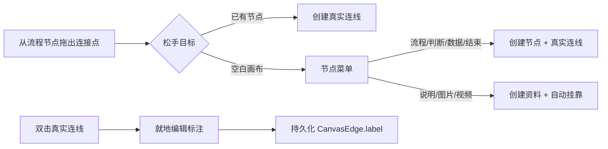
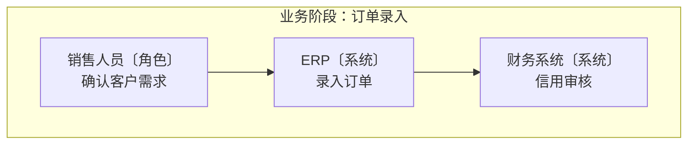

# 画布直接创作与流程明细设计

**日期：** 2026-07-12  
**状态：** 已实现并验证

## 目标

让流程梳理者不必在工具栏、画布和属性面板间反复往返：从节点拖线即可在目标位置创建下一项；双击连线即可写明流转条件；每个流程节点能在画布中直接表达“做什么”和“关键明细”。

同时以业务阶段表达时间顺序，以角色和系统混合泳道表达职责边界，让一张图同时回答“何时做、谁来做、在哪个系统做”。

## 范围与边界

### 1. 从空白处拖线创建

- 用户从一个节点的连接点拖出并在空白画布松手时，画布在松手位置打开“创建下一项”菜单。
- 菜单分两组：
  - **业务流程：** 流程、判断、数据、结束。选择后在松手的画布坐标创建节点，并自动写入一条真实业务连线。
  - **节点资料：** 说明、图片、视频。仅当起点是 source-free 一级主流程时可选；选择后创建资料并自动 `contentParentId` 挂靠起点。资料采用既有虚线层级关系显示，不创建真实业务连线。
- 不在菜单中提供“开始”节点；它不能作为已有流程的下一步。
- 用户按 Escape、点击菜单外或取消时，不创建节点、不创建连线。
- 已有节点之间的直接连线保持原有行为；自动整理预览期间不可触发此交互。

### 2. 双击连线标注

- 仅真实、可持久化的业务连线支持双击。资料层级虚线与展开子指南的来源连线不支持编辑。
- 双击后，在鼠标附近打开轻量“连线标注”编辑框，预填当前 label。
- Enter 保存，Escape 取消；清空内容后保存表示删除标注。
- 标注通过现有 `CanvasEdge.label` 持久化，进入历史栈、自动保存与发布版本。
- 判断分支用“是 / 否”等标注；普通流转可用“提交审核”“补充资料”等动作或条件。

### 3. 流程节点明细

- `start/end/process/decision/data` 节点在右侧属性面板中，标题下新增“节点明细”多行输入。
- 明细写入既有 `FlowData.description`，无需变更数据 schema。
- 画布节点标题下以较小字号展示明细，最多两行，超出截断；完整内容始终可在右侧编辑。
- 新建业务流程节点保持空明细，避免用占位文案污染实际流程。

### 4. 可命名业务阶段与混合责任泳道

- **业务阶段：** 仍是从上到下的时间/业务顺序。作者可新增、重命名并调整顺序；默认“业务阶段 N”只是一条初始名称，不能作为最终限制。
- **责任泳道：** 新增可选的 `lanes` 集合；每条泳道具有 `id`、`title`、`order` 与 `kind`，其中 `kind` 为 `ROLE` 或 `SYSTEM`。同一指南允许混合使用角色和系统，例如“销售人员〔角色〕”“ERP〔系统〕”“财务系统〔系统〕”。
- **节点归属：** source-free 一级主流程节点可选 `laneId`，并且只可指向文档中存在的泳道；资料继续通过 `contentParentId` 继承父流程节点的阶段与责任语境。展开子指南产物不写入 `laneId`，仅在展示时继承引用节点的阶段/泳道。
- **作者侧管理：** 左侧结构区分别提供“业务阶段”与“责任泳道”管理。两者都支持新增、重命名、上移/下移；新增泳道时作者选择“角色”或“系统”。节点属性面板显示“所属业务阶段”和“责任泳道”两个选择项。
- **自动整理：**
  - 无泳道的旧文档：保留既有“入口从左到右、阶段从上到下”的布局和行为。
  - 含泳道的文档：启用二维网格，阶段是从上到下的行，泳道是从左到右的列；同一“阶段 × 泳道”格中的多个主流程节点按原业务可达顺序稳定纵向排布；挂靠资料放在其主流程节点下方，不跨入别的责任列。
  - 阶段背景横跨所有已配置泳道；泳道列在画布顶部显示名称与“角色/系统”标识，并跟随平移和缩放。未归属节点进入“未分阶段/未分配责任”区域，不丢失也不阻断发布。
  - `未分配责任`是布局生成的虚拟泳道，而不是可保存的角色或系统：其展示边界可使用 `laneId: null`、`kind: null`，UI 固定显示“未分配责任”，不能在节点属性中选择、重命名或排序。
- **直接创作默认值：** 从主流程节点拖线到空白处创建新的主流程节点时，默认继承起点的 `stageId` 和 `laneId`；作者可以立即在右侧属性面板修改。创建资料时同样继承父节点语境，但只保存既有 `contentParentId`。
- **学习者：** 学习模式仍按业务阶段呈现，当前节点额外显示责任提示（例如“销售人员 · ERP”），帮助学习者理解操作由谁和哪个系统完成，而不是引入第二条学习顺序。

## 交互与状态

## 验收标准

1. 空白拖线到“流程”会在精确落点创建 process，并连回起点；取消不留下任何数据。
2. 从一级主流程拖线选择“说明”会创建 Markdown，设置 `contentParentId`，且不新增业务 edge。
3. 不能从资料或预览状态创建挂靠资料/节点。
4. 双击真实连线能新增、修改、清空标注；层级虚线不能打开编辑框。
5. 流程节点的“节点明细”可编辑、保存，在画布显示至多两行；无明细时不占额外空间。
6. 新增行为进入 undo/redo、自动保存和发布快照；既有画布交互与旧文档不回归。
7. 阶段和泳道均可命名并稳定排序；节点只能挂靠到存在的 source-free 阶段/泳道。
8. 配置泳道后自动整理按“阶段行 × 责任列”布局，阶段从上到下，角色/系统从左到右；无泳道文档继续使用旧布局。
9. 资料和展开子指南产物只继承宿主语境，不成为宿主二维布局的独立输入。
