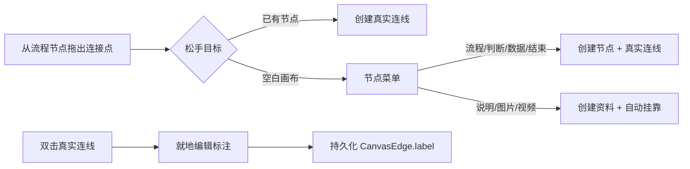

# 画布直接创作与流程明细设计

**日期：** 2026-07-12  
**状态：** 已确认，待实现

## 目标

让流程梳理者不必在工具栏、画布和属性面板间反复往返：从节点拖线即可在目标位置创建下一项；双击连线即可写明流转条件；每个流程节点能在画布中直接表达“做什么”和“关键明细”。

## 范围与边界

### 1. 从空白处拖线创建

- 用户从一个节点的连接点拖出并在空白画布松手时，画布在松手位置打开“创建下一项”菜单。
- 菜单分两组：
  - **业务流程：** 流程、判断、数据、结束。选择后在松手的画布坐标创建节点，并自动写入一条真实业务连线。
  - **节点资料：** 说明、图片、视频。仅当起点是 source-free 一级主流程时可选；选择后创建资料并自动 `contentParentId` 挂靠起点。资料采用既有虚线层级关系显示，不创建真实业务连线。
- 不在菜单中提供“开始”节点；它不能作为已有流程的下一步。
- 用户按 Escape、点击菜单外或取消时，不创建节点、不创建连线。
- 已有节点之间的直接连线保持原有行为；自动整理预览期间不可触发此交互。

### 2. 双击连线标注

- 仅真实、可持久化的业务连线支持双击。资料层级虚线与展开子指南的来源连线不支持编辑。
- 双击后，在鼠标附近打开轻量“连线标注”编辑框，预填当前 label。
- Enter 保存，Escape 取消；清空内容后保存表示删除标注。
- 标注通过现有 `CanvasEdge.label` 持久化，进入历史栈、自动保存与发布版本。
- 判断分支用“是 / 否”等标注；普通流转可用“提交审核”“补充资料”等动作或条件。

### 3. 流程节点明细

- `start/end/process/decision/data` 节点在右侧属性面板中，标题下新增“节点明细”多行输入。
- 明细写入既有 `FlowData.description`，无需变更数据 schema。
- 画布节点标题下以较小字号展示明细，最多两行，超出截断；完整内容始终可在右侧编辑。
- 新建业务流程节点保持空明细，避免用占位文案污染实际流程。

## 交互与状态

## 验收标准

1. 空白拖线到“流程”会在精确落点创建 process，并连回起点；取消不留下任何数据。
2. 从一级主流程拖线选择“说明”会创建 Markdown，设置 `contentParentId`，且不新增业务 edge。
3. 不能从资料或预览状态创建挂靠资料/节点。
4. 双击真实连线能新增、修改、清空标注；层级虚线不能打开编辑框。
5. 流程节点的“节点明细”可编辑、保存，在画布显示至多两行；无明细时不占额外空间。
6. 新增行为进入 undo/redo、自动保存和发布快照；既有画布交互与旧文档不回归。
