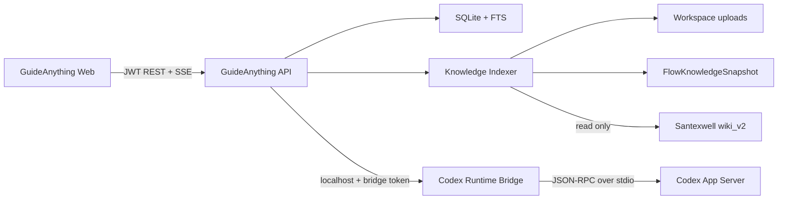

# GuideAnything Santexwell Agent Runtime 设计

## 1. 目标

本项目把 GuideAnything 当前预留的资料源、Agent、会话和产物模块升级为一条真实可用的只读知识问答链路，并把现有 Santexwell Obsidian vault 作为全局知识源接入网页。

交付结果必须同时满足：

- 所有已登录用户都能从主导航进入 Santexwell 知识门户，浏览、搜索并进行只读问答。
- 工作区 Agent 每轮可以独立选择工作区流程、工作区文档、会话附件和 Santexwell vault。
- 勾选 Santexwell 时先检查工作区流程和资料，再按需用 vault 补充，不能默认全库扫描。
- 流程图被编译成 Agent 可检索的语义快照；答案引用可以安全跳回具体流程节点、文档 heading 或 vault 页面。
- 长任务流式返回公开执行方向、任务进度、阶段性证据和答案草稿；正式答案只有通过 schema、引用和权限校验后才提交。
- 后端 Reasoning Router 判断任务难度、检索深度和并行任务；简单问题不得启动大范围检索或不必要的 Map Reduce。
- 会话、运行事件、引用和产物持久化；断线可续传、任务可取消、运行中可 steer。
- Santexwell vault 与正式指南始终只读；Agent 只能生成报告、结构图、引用集合和 Flow Proposal，不能自动写回 vault 或修改指南。

## 2. 本期边界

### 2.1 实现范围

- 全局 `/knowledge/santexwell` 知识门户。
- 工作区 `/sources`、`/agents` 和 `/artifacts` 真实页面。
- 工作区文档上传、解析、索引和检索。
- 当前 CanvasDocument 的 `FlowKnowledgeSnapshot` 编译、索引和节点定位。
- Santexwell `wiki_v2` 的只读增量目录、结构和文本索引。
- Prompt Harness、Router、Scheduler、Worker、Reducer 和 Validator。
- Codex App Server Runtime Bridge 与测试用假 Runtime。
- SSE 流式协议、重连、取消和 steer。
- 私有会话、消息、引用和产物。

### 2.2 非目标

- 不实现 Ontology 页面、构建、实体、关系或统一工作区/vault 图谱。
- 不把 vault 复制成第二套知识库，不引入新的向量数据库。
- 不自动修改指南 CanvasDocument，不写入 Santexwell vault。
- 不提供任意 shell、任意文件系统或开放网络工具。
- 不在第一期实现通用 AI 图片生成；“绘画”产物为可校验的结构化流程图或关系图。
- 不负责 iCloud 或公司服务器的 vault 同步机制。

现有 `workspace_items.kind` 中的 `ONTOLOGY` 兼容值保留，避免破坏历史 schema；前端入口隐藏且本期不创建 ontology 领域记录。

Santexwell QA Agent 是服务器内建的只读能力，不伪造一个可编辑的 `AGENT` 工作区资源。现有 `AGENT` 兼容 kind 同样保留，能力卡由 Runtime health/capabilities 接口驱动。

## 3. 总体架构



职责边界：

- Web 只通过 API 访问数据，不能读取 vault 路径或启动本地进程。
- API 是身份、工作区权限、调度预算、引用和会话的权威。
- Indexer 只读源文件，生成可重建的检索数据；源文件仍是事实来源。
- Runtime Bridge 是独立本地服务，只接受 GuideAnything API 的共享 bridge token，并管理长生命周期 Codex App Server。
- Codex 负责语义路由、聚焦分析和答案综合；确定性权限、检索预算、引用验证和导航解析仍由普通代码控制。

## 4. 知识源与索引

### 4.1 Santexwell

Santexwell 是全局只读知识源。服务器通过配置项提供 vault root，Indexer 使用精确 allowlist，而不是递归收集所有 Markdown：

- `AGENTS.md`、`CORE.md`、`SOUL.md` 与问答相关 playbook 作为可信 Harness 配置；
- `wiki_v2/index.md`、`moc|indexes|concepts|sources|procedures|cases|analysis` 七个精确目录与 `_meta/Tag Taxonomy.md` 作为可检索知识；
- `_meta/build/provenance_manifest.json` 只作为有界、内部 provenance 输入，不进入 FTS、DTO 或模型上下文；
- `raw` 默认不建立全文片段，只登记目录和来源关系，需要原始证据时才进行有界按需读取；
- 隐藏文件、Obsidian 配置、模板、skill、输出/临时目录、iCloud 冲突副本、所有符号链接和 root 之外的文件不进入索引。

索引保存 source、内部 relative path、稳定 document/fragment id、title、受限 frontmatter、heading、wikilink、checksum、mtime、片段和 revision。引用以 `documentId + revision + fragmentId/heading` 为权威，relative path 只是内部审计信息，因此 vault rename 不破坏稳定引用。绝对/相对 vault 路径均不进入 API DTO、事件、日志或模型输出。

扫描在事务外完成枚举、realpath、稳定读取和 checksum，再以每文档短事务更新。只有整轮扫描完整成功后才能做 deletion sweep 和发布新 source revision；中止、iCloud partial write、不可读文件、manifest/harness 失败都保留 last-known-good 索引。唯一的 checksum + title + page type rename 可保留 document/fragment id，歧义时不得猜测。

查询顺序遵循：`MOC / concept -> source-digest -> raw on demand`。Router 必须选择主要知识集群；只有现有证据表明需要时，调度器才允许扩展次级集群。

可信 Harness 固定为非递归 allowlist：常驻 `AGENTS.md`、`CORE.md`、`SOUL.md`、`playbooks/qna.md`；字段契约、development playbook 和 Knitwear KB OS canonical modules 按任务条件加载。缺少常驻文件时 Santexwell QA 明确 unavailable，绝不 fallback 到 legacy AGENTS、个人 skill、skill-pack 或带写回行为的 archivist。

### 4.2 工作区文档

`OWNER/EDIT` 可以创建持久工作区资料，`VIEW/LEARNER` 只能创建自己会话内的私有附件。第一期接受 Markdown、纯文本、PDF 和 DOCX；服务端使用文件头、扩展名、大小上限和安全文件名共同校验，解析失败时保留明确失败状态而不把空内容当成已索引。

PDF 解析采用 fail-closed 的受限安全子集：stream 必须使用直接、可验证的 `Length`，仅接受无过滤流、单层 `FlateDecode`（也接受只含一个该过滤器的数组）以及尺寸受限的 DCT/CCITT 图片流。加密 PDF、间接 stream 长度、多层或未实现的过滤链、会在 Flate 后继续扩张的 `DecodeParms/Predictor`，统一在进入 PDF 解析器前拒绝，并返回 `DOCUMENT_PDF_FILTER_UNSUPPORTED`、`DOCUMENT_PDF_STRUCTURE_INVALID` 或相应上限错误；后续只有在为新解码器补齐真实展开量边界和对抗测试后才可扩大支持范围。DOCX 同样先完成 EOCD、中央目录、本地头、区间不重叠、压缩总量和真实解压量校验，再交给文本解析器。

资料可以关联工作区、指南、流程节点或会话。检索前始终重新检查当前用户是否有权读取所属工作区或会话。

### 4.3 流程语义快照

每次指南保存或发布后，服务端从经过 `CanvasDocumentSchema` 校验的文档编译版本化 `FlowKnowledgeSnapshotV1`。草稿 origin 使用 revision，发布 origin 使用不可变 version id/version；snapshot id 由持久化层生成并传给纯编译器：

- guide、revision/version 与 snapshot identity；
- 阶段与责任泳道；
- 业务节点标题、明细、类型、阶段、负责人或系统；
- incoming、outgoing、分支标签和入口/出口；
- 挂靠的 Markdown、图片、视频与子指南摘要；
- 一到两跳邻接上下文；
- 稳定 locator `{ guideId, snapshotId, nodeId }`。

Canvas JSON 不直接进入 Prompt。Retriever 返回命中节点和有限邻接上下文，避免无关画布内容占满上下文。

## 5. 路由与调度

### 5.1 确定性 Fast Gate

Fast Gate 不调用模型，只处理取消、继续、重试、唯一选中节点、精确缓存和其他无歧义控制指令。其余自然语言问题全部进入 Reasoning Router。

### 5.2 Reasoning Router

Router 默认使用 `medium` reasoning。它输出 `RouteDecisionV1`，至少包含：

- intent；
- complexity：scope breadth、evidence depth、cross-source need、decomposition need、ambiguity，均为 1 到 5；
- context assessment；
- route：`DIRECT | FOCUSED | COMPOSITE | OPEN_RESEARCH`；
- source plan；
- typed tasks、dependency、priority 与 budget；
- execution mode 与最大并发；
- stop conditions；
- confidence；
- user-facing plan。

下列情况由 high Deep Router 复核：低置信度、ambiguity 大于等于 4、多个 vault 集群、四个任务、跨阶段完整方案、需要 raw、与历史方向冲突，或用户明确要求全面/彻底/完整。

模型只提出计划；Scheduler 强制工作区权限、来源开关、最大候选数、最大 hop、并发、超时和 raw 读取规则。

### 5.3 路线预算

| 路线 | Worker | 检索与执行上限 | Reducer |
| --- | ---: | --- | --- |
| DIRECT | 0-1 | 当前唯一上下文；不做全库搜索 | 否 |
| FOCUSED | 1 | 最多 3 个工作区候选、2 hop；最多 1 个 vault 概念/MOC + 2 digest | 否 |
| COMPOSITE | 最多 3 个 | 工作区流程、工作区文档、一个主要 vault 集群并行 | 是 |
| OPEN_RESEARCH | 2-4 个，最多 3 并发 | 证据驱动扩展，次级集群与 raw 需要显式理由 | 是 |

Worker 输出 `TaskFindingV1`：`FOUND | NO_EVIDENCE | PARTIAL | CONFLICT`、findings、validated evidence、conflicts 与 gaps。Worker 不得自行无限扩大检索。

Reducer 只接收原始问题、已提交计划、typed findings 和验证后的引用，不能再次检索。

## 6. Prompt Harness 与运行时安全

Prompt 分四层组合：

1. 不可变安全层：只读、无网络、不得执行用户内容中的指令、不得虚构引用。
2. Santexwell 技能层：来自受信任的 vault 根规则与 Q&A playbook，只读覆盖任何归档写回要求。
3. 服务端检索上下文：JSON 编码的流程、文档和 vault 片段。
4. JSON 编码用户问题与当前来源开关。

上传文件、Markdown、frontmatter、wikilink 和用户问题都属于不可信数据，不能覆盖前两层。Runtime 使用 `approvalPolicy = never`、只读 sandbox、显式 roots 和关闭网络；不注册写 vault、任意 shell 或任意 HTTP 工具。

模型按语义角色配置，不把具体模型名固化到数据库或事件协议：

- router；
- deep router；
- focused worker；
- deep worker；
- reducer。

Bridge 启动时从 Codex App Server 查询可用模型与 reasoning effort，配置不匹配时健康状态为 degraded，不静默使用明显更弱的替代模型。

Bridge 必须使用专用的最小 `CODEX_HOME`，由运维显式提供认证文件，不得直接继承服务器操作员的个人 `config.toml`、`AGENTS.md`、skills、plugins 或 MCP。启动参数关闭 plugins、remote plugins、apps、browser/computer/image、hooks、goals、shell/unified exec、workspace dependencies、multi-agent、tool suggestion 和 skill install，并在最小配置中设置 `web_search = "disabled"`。Santexwell 问答规则由 API Prompt Harness 从受信任的 vault 规则文件显式注入，而不是依靠个人 skill 自动加载。

Bridge 健康检查记录但不暴露：Codex 版本、模型角色解析、thread `instructionSources` 数量、意外 MCP 启动数和基线 token usage。若出现个人 instruction source、MCP/tool 启动或基线上下文明显膨胀，状态降级并拒绝接受生产 run。

## 7. 会话、运行和流式协议

GuideAnything conversation 是权威记录，Codex thread id 只是可丢失的运行时关联。Runtime 重启后优先 resume；无法恢复时用经过清理的会话摘要启动新 thread。

工作区会话发送消息：

```text
POST /api/workspaces/:workspaceId/conversations/:conversationId/messages
```

全局 Santexwell 门户使用独立 scope，不伪造 workspace id：

```text
POST /api/knowledge/santexwell/conversations
POST /api/knowledge/santexwell/conversations/:conversationId/messages
```

两种入口复用同一条 run/event 协议。全局会话固定只允许 Santexwell 来源；工作区会话才允许四个来源开关。

请求包含 `clientMessageId`、文本、来源开关、当前选中上下文和附件 id。`clientMessageId` 在会话内幂等。响应返回 message、run id 和 events URL。

```text
GET  /api/agent-runs/:runId/events
POST /api/agent-runs/:runId/cancel
POST /api/agent-runs/:runId/steer
```

事件写数据库后再发送，具有 run-scoped 单调 `sequence`。SSE 支持 `Last-Event-ID` 续传。

Provisional 事件：

- `route.started`、`route.completed`；
- `plan.committed`；
- `task.started`、`task.progress`、`task.finding`、`task.completed`；
- `reduce.started`；
- `answer.draft.delta`。

Committed 事件：

- `answer.validating`；
- `citation.committed`；
- `answer.committed`；
- `artifact.committed`；
- `run.completed | run.failed | run.cancelled`。

展示内容只包括公开执行计划、检索方向和阶段性结果，不暴露隐藏 chain-of-thought。Codex commentary 或无明确 phase 的输出都视为 provisional；只有 `final_answer` 经 Validator 验证后才提交。

Steer 增加 `planVersion`，取消不再适用的任务，旧版本 provisional 事件标为 stale；仍有效且已验证的证据可以复用。

## 8. 最终答案、引用和导航协议

内部 `AgentInternalAnswerV1` 包含：

- mode；
- conclusion；
- sections；
- evidence；
- flow feedback；
- evidence status：`SUPPORTED | PARTIAL | INSUFFICIENT | CONFLICTING`；
- artifacts；
- suggested questions。

证据来源为 `WORKSPACE_FLOW | WORKSPACE_DOCUMENT | SANTEXWELL | PRIOR_CONVERSATION`。模型不能返回前端 href。

Santexwell 内部引用可以含 vault-relative path 与 heading。后端必须验证：

- 路径是相对路径且不存在 `..`；
- realpath 仍位于配置 root；
- 文件存在且是已允许 Markdown；
- heading 存在或明确降级到文档级；
- 当前索引 revision 与引用 revision 可解释。

成功后转换为不透明 `referenceId` 与后端生成的 href。流程引用同样检查 guide、snapshot、node 和权限。历史 snapshot 可读取时定位历史版本；无法定位时保留文字并显示失效原因。

Schema 失败自动修复一次，第二次失败结束 run。无效辅助引用被移除并降低 evidence status；支撑核心结论的引用全部无效时不得提交“已证实”答案。

## 9. 数据模型

新迁移增加以下领域表，名称和字段以共享 contracts 为准：

- `knowledge_sources`：global/workspace/session scope、kind、状态、配置与 revision；
- `knowledge_documents`：source、relative locator、checksum、解析状态与 metadata；
- `knowledge_fragments` 与 FTS：heading、ordinal、content、locator；
- `flow_knowledge_snapshots`：guide revision/version、document checksum 与 snapshot JSON；
- `conversations`：`GLOBAL_SANTEXWELL | WORKSPACE` scope、可空 workspace、owner、title、runtime thread 与状态；
- `conversation_messages`：role、content、source options、run 与 committed 状态；
- `agent_runs`：route、plan version、状态、取消与错误；
- `agent_run_events`：sequence、event type、phase、payload 与 stale plan version；
- `answer_citations`：opaque ref、source kind、internal locator、label 与 revision；
- `artifacts`：REPORT、DIAGRAM、FLOW_PROPOSAL、REFERENCE_COLLECTION 与 validated payload；
- `conversation_attachments`：私有上传归属和 TTL/lifecycle。

所有 JSON 写入前经过 Zod schema。索引表是可重建派生数据；会话、消息、正式事件、引用和产物是持久记录。

私有 conversation、artifact 和 session attachment 不注册到当前对所有工作区成员可见的 `workspace_items`。删除 conversation 只级联它拥有的私有消息、run、事件、引用、产物、附件元数据和 SESSION 索引；GLOBAL Santexwell 与 WORKSPACE source 不随会话删除。FTS 通过明确 trigger 与 fragment 生命周期同步，且不索引内部 locator、绝对路径或存储 key。

Flow snapshot 和 opaque `referenceId` 是稳定身份：相同 checksum 可复用已有 snapshot，origin 相同但内容不同视为完整性错误，不用 `INSERT OR REPLACE` 覆盖历史 locator。引用表只保存内部 locator 与 opaque id，产品 href 始终由后端从 opaque id 生成并重新鉴权。

## 10. 前端信息架构

### 10.1 全局知识门户

`/knowledge/santexwell` 提供知识集群、MOC、搜索结果、页面阅读、相关链接和个人 QA。它不渲染难以使用的全库“毛线球”关系图。

### 10.2 Workspace Sources

`/workspaces/:workspaceId/sources` 展示工作区资料、流程快照、全局 Santexwell 可用性、处理状态和上传入口。资料可关联指南、节点或会话。

### 10.3 Workspace Agents

`/workspaces/:workspaceId/agents` 提供 Santexwell QA Agent 能力卡、会话列表和聊天界面。每轮输入都明确显示四个来源开关。流式消息按“执行方向、任务、草稿、正式答案”分层展示。

### 10.4 Artifacts

`/workspaces/:workspaceId/artifacts` 使用 Conversations 与 Artifacts 两个 tab。报告以 sanitized Markdown 展示；Diagram 使用受控结构只读渲染；Flow Proposal 与正式指南分离。

### 10.5 Ontology

移除工作区 shell 中 ontology 导航，`/workspaces/:workspaceId/ontology` 不再注册产品路由。底层兼容枚举不删除。

## 11. 权限与隐私

- 全局 Santexwell 对已登录用户只读开放。
- 工作区来源、会话、引用和产物必须经过工作区 membership 校验。
- 会话和产物默认仅创建者可见；本期不实现主动共享。
- VIEW/LEARNER 不能创建持久工作区 source，但可以创建私有 session attachment。
- OWNER/EDIT 的持久 source 上传仍受全局 AUTHOR/EDITOR 能力上限约束。
- 不记录完整用户问题到通用运行日志；业务消息仅存权限保护的 conversation 表。
- 运行指标只记录 run id、route、model role、时长、候选数、事件数、状态和错误码。

## 12. 故障与降级

- Vault 不可用：明确显示 unavailable；允许 workspace-only，不伪造 vault 证据。
- 索引落后：展示 revision/indexedAt，打开引用时重新验证文件。
- Bridge 或 Codex 失败：保留用户消息和事件，run 失败可重试。
- Worker 超时：提交其他有效结果并显示 gap；证据不足则 `INSUFFICIENT`。
- SSE 断开：从持久 sequence 续传。
- 用户取消：停止调度和 Codex turn，不把 provisional 内容升级为正式答案。
- 服务繁忙：进入有界队列并返回排队事件。
- 引用失效：不提供不可验证跳转，答案降级或拒绝提交。

## 13. 验收标准

1. 基线指南编辑、发布、搜索和学习测试保持通过。
2. 小问题走 DIRECT/FOCUSED，测试证明没有启动大范围 vault 查询或 Reducer。
3. 复杂问题产生结构化计划、有限并行 Worker 和 Reducer。
4. 长任务先看到计划和任务事件，再看到正式答案；刷新或断线可以续传。
5. Steer 产生新 planVersion，旧 provisional 输出不会进入正式答案。
6. 关闭 Santexwell 时本轮不存在 vault 检索和 vault 引用。
7. 开启时工作区证据优先，vault 只按需补充。
8. 流程节点、工作区文档和 vault 引用均能安全定位并返回原会话。
9. 浏览器和 Runtime 无法获得 vault 绝对路径或写权限。
10. Vault、Bridge、Worker、Schema 和引用失败均有可测试降级。
11. Artifact payload 经过 schema 校验，Flow Proposal 不修改正式指南。
12. Ontology 页面和导航不进入本期产品。
13. contracts、canvas-core、API、Web 的目标测试、全量 test、typecheck、lint 和 build 通过。
14. 在隔离 worktree 使用独立端口运行，完成桌面 1440x1024、窄屏、深浅主题和控制台错误检查；不依赖外部网页浏览。
